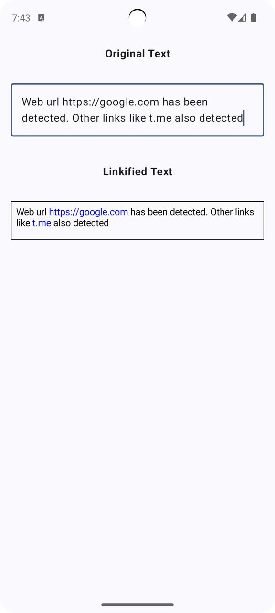

# LinkifyText Composable for automatically detecting links in a text



## Usage

You need to use the following artifact in your build.gradle
````
implementation("io.github.khudoyshukur:linkify-text:1.0")
````


For simple use case use the following snipped below:
````
val content = LinkifyContent(originalText = text)

LinkifyText(
    modifier = Modifier, // your customization here
    content = content,
    style = TextStyle.Default, // your custom style also can be here
    onUrlClicked = { url ->
        // Your action here
    }
)
````


You can customize how the links are styled:
````
val content = LinkifyContent(
    originalText = text,
    spanStyle = SpanStyle(
        color = Color.Blue,
        textDecoration = TextDecoration.Underline
    )
)
````


You can customize how the links are determined:
````
val content = LinkifyContent(
    originalText = text,
    linkMatcher = object : LinkMatcher {
        override fun isLink(text: String): Boolean {
                return Patterns.WEB_URL.matcher(text).matches() || text.startsWith("@")
            }
    }
)
````


You can customize what are the word dividers (default is ' ' and '\n'):
````
val content = LinkifyContent(
    originalText = text,
    wordDividers = setOf(' ', '\n', '&')
)
````


## License

MIT, see [`LICENSE.txt`](LICENSE.txt).
